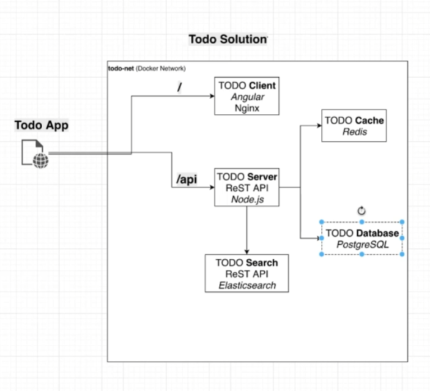

# this guid show how to deploy todo-app with docker



1. Clone the repo [todo-starter](https://github.com/Avshalom-Ts/todo-starter)

2. Create the network in docker

    ```bash
    docker network create todo-net
    ```

    Make shure the networks was created

    ```bash
    docker network ls
    ```

    Deploy new postgresql container

    ```bash
    docker run --net todo-net --name todo-postgres -p 5432:5432 -e POSTGRES_USER=todo -e POSTGRES_PASSWORD=todo1234 -e POSTGRES_DB=todo -d postgres:11.2
    ```

    Check if container is running

    ```bash
    docker container ls
    ```
