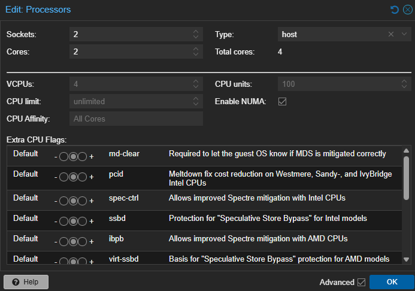
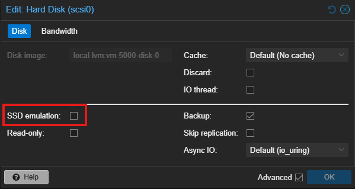
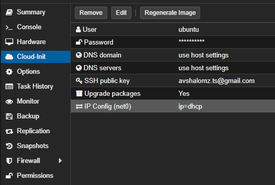
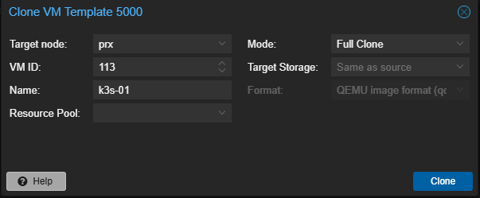

# k3s-setup-proxmox

This repo is intend to create and documanted the proces of creating k3s in my home lab.

## Stage 1 [YouTube-GimsGarage-01](https://www.youtube.com/watch?v=dQMWTULEbS0&ab_channel=Jim%27sGarage)

Explanations about the implementation

## Stage 2 [YouTube-GimsGarage-02](https://www.youtube.com/watch?v=Kv6-_--y5CM&ab_channel=Jim%27sGarage)

1. Download the disk image from [jammy-server-cloudimg-amd64-disk-kvm.img](https://cloud-images.ubuntu.com/jammy/current/) in proxmox ISO Images GUI

    - In the proxmox host, go to shell and insert the pollowing commanda: [Taken from JimsGarage repo](https://github.com/JamesTurland/JimsGarage/tree/main/Kubernetes/Cloud-Init)

2. Create the VM via CLI

    ```bash
    # Creat the vm with id-5000 2048-ram 2-core-cpu name ubuntu-cloud and internet bridge
    qm create 5000 --memory 2048 --core 2 --name ubuntu-cloud --net0 virtio,bridge=vmbr0
    # Change directory to the downoald ubuntu image that was download
    cd /var/lib/vz/template/iso/
    # Creating the disc on the vm in the local-lvm storage. To set the boot dvice on the vm created 
    qm set 5000 --scsihw virtio-scsi-pci --scsi0 local-lvm:vm-5000-disk-0
    # Attaching cd drvie to the vm for cloud init
    qm set 5000 --ide2 local-lvm:cloudinit
    # Mounting the boot drive to the vm 
    qm set 5000 --boot c --bootdisk scsi0
    # Its the physical equivalent of plugging in a VGA monitor (good if there is no option to connect via ssh) VNC in proxmox
    qm set 5000 --serial0 socket --vga serial0
    # Optional - Expand the VM disk size to a suitable size (suggested 10 GB)
    qm disk resize 5000 scsi0 10G
    ```

3. In the GUI: Create the Cloud-Init template
    In the hardware section
    - Change the type of cpu to host (important to the host capabilities inted of viatual)
    
    - If the host have ssh and vm stor on it, turn on the hard-disk `ssd emulation`
    
    In the cloud init section
    - Change the default user to `ubuntu`, Set the password of the user, put the ssh public key, set the ip config to DHCP othere waise it will clone the same ip on template clone proces.
    
    - !IMPORTANT - Dont start the vm before converting it to tamplate othere waise it will clone the mac addres,unique adentifire and ip as well.

4. Deploy 5 new VMs by cloning the template (full clone)


## Stage 3 [YouTube-GimsGarage-03](https://www.youtube.com/watch?v=6k8BABDXeZI&ab_channel=Jim%27sGarage)

1. Modifie the VMs IPs to match the subnet they running in and config the ip for the HA(Nginx)(vip), Then Run the script `/K3S-Deploy/k3s.sh` to set up [k3sup](https://github.com/alexellis/k3sup) and [Kube-VIP](https://kube-vip.io/)

2. Upload it to az-labs VM to be able to run it (Dont forgrt to copy the id_rsa and id_rsa.pub keys to the .ssh folder in az-labs VM, The script using it) use the [WinSCP](https://winscp.net/eng/index.php) to connect and move the files.

## Stage 4 [YouTube-GimsGarage-04](https://www.youtube.com/watch?v=hT2_O2Yd_wE&ab_channel=Jim%27sGarage)

- Get node running

    ```bash
    kubectl get nodes
    ```

- Get the pods runnings

    ```bash
    kubectl get pods
    ```

1. Installing [Helm](https://helm.sh/docs/intro/install/) in az-labs vm From script

    ```bash
    curl -fsSL -o get_helm.sh https://raw.githubusercontent.com/helm/helm/main/scripts/get-helm-3
    ```

    ```bash
    chmod 700 get_helm.sh
    ```

    ```bash
    ./get_helm.sh
    ```

    - Chech Helm installed corectly

    ```bash
    helm version
    ```

2. Installing [Rancher](https://ranchermanager.docs.rancher.com/getting-started/quick-start-guides/deploy-rancher-manager/helm-cli) in az-labs vm

    - Because we using the k3s latest releas `kubectl version`, we need to install the alfa releas for rancher.

    ```bash
    helm repo add rancher-alpha https://releases.rancher.com/server-charts/alpha
    # OR
    helm repo add rancher-latest https://releases.rancher.com/server-charts/latest
    # OR
    helm repo add rancher-stable https://releases.rancher.com/server-charts/stable

    kubectl create namespace cattle-system

    kubectl apply -f https://github.com/cert-manager/cert-manager/releases/download/v1.11.0/cert-manager.crds.yaml

    helm repo add jetstack https://charts.jetstack.io

    helm repo update

    helm install cert-manager jetstack/cert-manager \
    --namespace cert-manager \
    --create-namespace \
    --version v1.11.0
    ```

    **Verifie it installed corectly**

    ```bash
    kubectl get pods --namespace cert-manager
    ```

    - If installed from the alpha repo

    ```bash
    helm install rancher rancher-alpha/rancher \
    --namespace cattle-system \
    --set hostname=rancher.az-labs.local \
    --set replicas=1 \
    --set bootstrapPassword=admin
    ```

    - If installed from the latest repo

    ```bash
    helm install rancher rancher-latest/rancher \
    --namespace cattle-system \
    --set hostname=rancher.az-labs.local \
    --set replicas=1 \
    --set bootstrapPassword=admin
    ```

    - If installed from the stable repo

    ```bash
    helm install rancher rancher-stable/rancher \
    --namespace cattle-system \
    --set hostname=rancher.az-labs.local \
    --set replicas=1 \
    --set bootstrapPassword=admin
    ```

    - Verify that the rancher server is successfully depoyed, can take some time due interner conection.

    ```bash
    kubectl -n cattle-system rollout status deploy/rancher
    # Check the deployment, (there is no external ip exposed yet)
    kubectl -n cattle-system get deploy rancher
    ```

    - Check the rancher service

    ```bash
    kubectl get svc -n cattle-system
    ```

    - To expose the rancher ip externaly

    ```bash
    kubectl expose deployment rancher --name rancher-lb --port=443 --type=LoadBalancer -n cattle-system exposed
    ```
